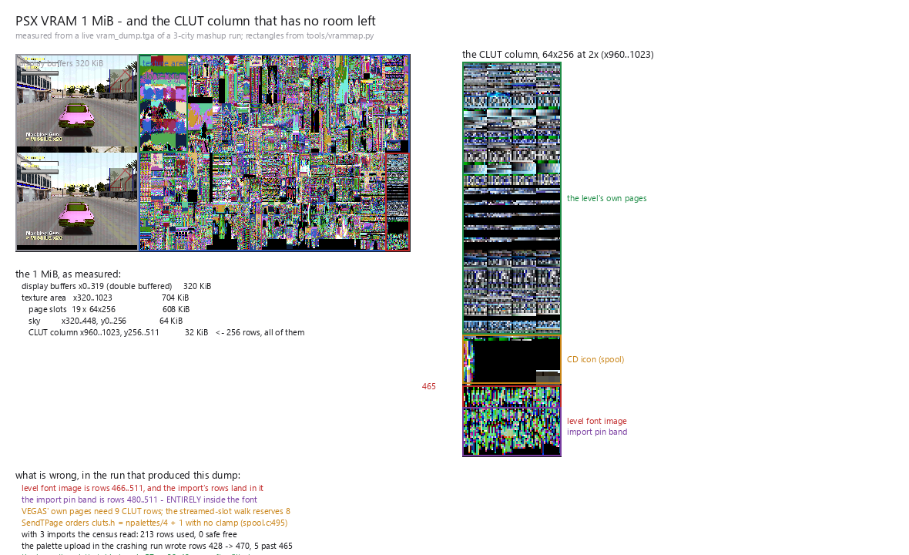

# Where VRAM goes: the base 1 MiB, the JERICHO arena, and how to measure it

The canonical reference for **VRAM layout and headroom**. Read this before changing any
VRAM layout, before reserving a region, or when a texture/page/palette misbehaves in a
way that "should not" be possible — the answer is usually that two systems own the same
rectangle and one of them did not know.

Cited `file:line` where the number comes from code. Anything measured was measured on
this install; the recipe to re-measure is §5.

Two tools, one answer:
- **`tools/vrammap.py`** — offline, from VRAM dumps: the cell map, free rectangles, and
  every code claim next to what the dumps show.
- **the engine's own `JERICHO-VRAM:` line** — the same accounting in the run, once per
  level load (see §5).

---



That picture is this document at a glance: a live `vram_dump.tga` of a **three-city
mashup run**, with the rectangles taken from `tools/vrammap.py` rather than drawn by
hand (the script is `tools/make_vram_issues_png.py`). The strip on the right is the CLUT
column itself, x960..1023 y256..511, at 2x — and the overlapping bands in it are the
problem: the level font image is rows **466..511** while the import's pin band is rows
**480..511**, so the pin band sits *entirely inside the font*.

The figure above is a **checkpoint**: every deliberate step of the CLUT work drops a
dated copy with its measured numbers into [`docs/vram/`](vram/README.md), so the
column's health can be read over time rather than only now. Take one with
`tools/chk_vram_checkpoint.sh <level> <mix> <tag> ["note"]` — it runs the mashup with
a dump, reads the numbers from that run's own log, stamps them into the figure, and
appends the index row.

## 0. The buffer is 2 MiB now: rows 0..511 base, rows 512..1023 JERICHO

The emulator's VRAM is **1024x1024** (PsyCross `PsyX_render.h`, `VRAM_HEIGHT`), i.e. 2 MiB
of texels, cut in two by what can ADDRESS it rather than by choice:

| rows | who can write/read it | what it is |
|---|---|---|
| **0..511** | every stock path: `tpagepos[]` (Y in {0,256}), the CLUT cursors, the display buffers, the sky, the level font | the base 1 MiB - everything in §§1-6 below |
| **512..1023** | JERICHO code only | the **arena**: `JerVramArenaPageAlloc` / `JerVramArenaClutAlloc` (`texture.c`), `JER_VRAM_HALF_Y` (`cars.h`) |

Rows >=512 are addressable because the tpage word's Y is not one bit: `getTPage` packs
bit 4 (Y+256) **and bit 11 (Y+512)**, and the renderer's shader decodes both
(`PsyX_render.cpp`, `v_page_clut.y`). So a page at row 512 or 768 is an ordinary tpage to
everything downstream. A CLUT's Y is 10 bits (`clut >> 6`) once the 9-bit masks are gone,
which is what `texture.c` and `pedest.c` now use - and the DR_TPAGE parser keeps bit 11
its own encoder (`_get_mode`) already wrote.

The arena is **30 pages** of 64x256 (two page-rows x 15 columns) plus a CLUT column
mirroring the base one at x960..1023, rows 512..1023. It starts at **x=0**: the base half
cannot, because x0..319 there is the display buffers, which is why the arena gets the full
width and 1024 KiB rather than a strip.

**Nothing stock can take it.** `tpagepos[]` holds only Y in {0,256} and the CLUT cursors
are bounded by `CD2_CLUT_SAFE_LAST`, so the arena is not a reservation that a flag could
leak - it is a row range no base-game path computes. Measured: a full level load leaves
rows 512..1023 **bit-exactly zero** (`vrammap.py`: `never-written: 1024 KiB of 2048`), and
the run's census reads `arena rows 512..1023: pages 0 used of 30 (30 free), clut rows 0
used (512 free)`.

**State: the import lives in the arena.** Since the placement landed, every imported page
and every imported CLUT comes from rows 512..1023. `CarImportPin` (`texture.c`) asks
`JerVramArenaPageAlloc` **first** and only falls back to the base-half passes (previous
slot / the replaced car's page / a free slot / a world eviction) when the arena is full, and
the import's CLUT band is the arena's own column (`firstFree = JER_VRAM_HALF_Y`). The base
half's strip is the LEVEL's again, so the "no CLUT-safe room" refusal and its `y=480`
fallback are deleted outright, and `sPinBandSafe` is now always 0.

Measured on the 3-city mix (host CHICAGO, 60 frames, seed 7):

| check | before | now |
|---|---|---|
| world pages **evicted** | 702 | **0** |
| sets "no longer looks loaded" | 5 | **0** |
| the level font, rows 466..511, vs a stock run | collided | **0 differing texels** |
| imported pages | 1 WORLD page taken | **9 of 9** at y=512, x from 0 in 64px steps |
| imported CLUT rows | the strip (466..511) | x960/992/1008, **y512..539** |
| `chk_suite.sh` | 2 rows red (INV1, evictions) | 6 of 7 green; the mix carries one INV2 finding (§7) |

A subtlety worth keeping: an arena pin has **no slot**. It is deliberately not recorded in
`tpageslots` / `tpageloaded` / `slot_clutpos` - those describe the world streamer's slot
space (`spool.c` indexes `slot_clutpos` with `tpageloaded[x] - 1`), and a row in the arena
is not one of its slots. Ownership is answered instead by `JerVramArenaPageOwned` from
`CarPageRectOwned`, and `tools/crosscheck.py` knows the `slot=-1 (arena)` marker so it does
not report a placed pin as unplaced.

§§4-6 below describe the BASE half and are still the map of what the arena is avoiding.
§6.1's account of the import's old pin band is historical where marked.

## 1. The base 1 MiB, in three parts

PSX VRAM is 1024x512 16-bit texels = 1 MiB, and that is exactly the base half (rows
0..511) of this build's buffer. This engine divides it like so:

| region | rect | size | owner |
|---|---|---|---|
| display buffer A | `(0,0) 320x256` | 160 KiB | `system.c:724-725` (`SetDefDispEnv(&MPBuff[0][0].disp, 0, 256, 320, SCREEN_H)`) |
| display buffer B | `(0,256) 320x256` | 160 KiB | same call, the other buffer — **double buffered** |
| texture area | `(320,0)..(1023,511)` | 704 KiB | everything else below |

The display buffers are **not texture memory** and 320 KiB of the 1 MiB is therefore not
available to anything: that is why `x0..319` looks completely full in a dump and why a
"free VRAM" figure over the whole 1 MiB is always ~0. The half that can be argued about
is the other 704 KiB.

## 2. The texture area is fully committed

| what | size | where |
|---|---|---|
| 19 page slots, 64x256 each | 608 KiB | the `tpagepos[20]` walk, `texture.c:11-34` |
| the CLUT column | 32 KiB | `x960..1023, y256..511`, cursors in `texture.c` |
| the sky | 64 KiB | `(320,0) 128x256`, `sky.c:280-282` |
| **total** | **704 KiB** | i.e. **0 KiB left over** |

The 19 slots are not a contiguous block; they tile two rows:

* `y=0`: `x 448..1024` — slots 13, 14, 15 then 0, 1, 2, 3, 4, 5
* `y=256`: `x 320..960` — slots 16, 17, 18 then 6, 7, 8, 9, 10, 11, 12

so `(448,0)`, `(512,0)`, `(576,0)`, `(320,256)`, `(384,256)`, `(448,256)` are slot
rectangles *outside* the rows the eye expects. A level's first `nperms` slots are its
permanent pages; the special car's pair follows; the rest are the world's stream pool.
Measured on Havana: `slotsused=14 nperms=12 nspecpages=8` — so 12 permanent pages, the
special car's 2, and **5 slots for the world to stream into**.

**A played level has no free texture VRAM.** Everything the engine commits, it commits
permanently or recycles inside those 5 slots. That is why an imported car's pages have to
be *taken* from something (see `HACK.md`, "Where an imported page may live now") and why
"squeezing VRAM" means taking it off an existing claim, not finding a gap.

## 3. The CLUT column

`x960..1023` is 64 px wide = **4 CLUTs per row** (16 px each), 256 rows, so 1024 CLUT
entries. `IncrementClutNum` (`texture.c:125`) walks it four-per-row and then `y++`.

Cursors, and the order they fill it, are in `PALETTES.md` §4. The number that matters
here is where the walk *stops*, because everything from there down is contended:

| state | last row used (`clutpos.y`) | free rows |
|---|---|---|
| stock, full level | 428 | 84 |
| with one imported car | 485 | 27 |

> **Historical - the arena removed this.** The import no longer takes rows from the strip
> at all: its palettes and page CLUTs come from the arena's own column below row 512
> (§0), and the "no CLUT-safe room" refusal plus its `y=480` fallback are deleted. The
> strip is the LEVEL's again. This section is kept because it is the clearest statement of
> why a 64px strip could not hold an import, and because the numbers below are what
> `tools/vrammap.py` still measures for the level itself.

The import's own palette *rows* were reserved from **480** down
(`max(clutpos.y + 4, 480)`), which is inside the 27 rows that are left. So the column is
about 89-95% committed on a full level, and an import's ~21 rows of palettes and page
CLUTs come out of the last ~27.

**And one claim already sits below the level's cursor.** The level font image is
`(960,466) 64x46` (`pres.c:584`) — rows 466..511 — while the level's own layout stops at
485 and the import's band starts at 489:

```
CLUT column contents, rows, vs the import's reserved rows (480..511)
  font CLUT              rows 256..256  above them (fine)
  map CLUT               rows 256..256  above them (fine)
  CD icon (spool)        rows 433..464  above them (fine)
  level font image       rows 466..511  COLLIDES with the import's rows
```

so an imported car's palette rows are written over the bottom ~23 rows of the HUD font
image, and `LoadFont` writes over the car's palette rows. `tools/vrammap.py` prints this
section for exactly this reason (see §5).

### The budget, measured row by row

`JERICHO_PAL_DIAG` readings (texture.c) print the cursor at each step, on every level
load. Havana with the RIO import of model 9:

| step | cursor | rows | what it is |
|---|---|---|---|
| after the host's palettes | y=304 | 48 | the whole host city palette table |
| after an import's palettes | y=361 | **57** | the whole FOREIGN city palette table |
| after the level's page CLUTs | y=445 | 84 | 12 permanent pages, 7 rows each |
| after the streamed-slot walk | y=485 | 40 | 8 rows per streamed slot (5 slots) |
| **total** | | **229** | |

The font owns 466..511, so the CLUT-safe area is 256..465 = **210 rows** and the layout
needs **229**: an import pushes the level's own CLUTs 19 rows into the font, and the pin
band (which starts at `clutpos+4` = 489) lands inside it too. That is the cross-city
palette corruption: the HUD font and the imported car's palettes overwrite each other
every frame.

The 57 rows are the whole foreign table for **one** car — the same "only what the car
names" rule the *pages* already follow. The allocation that fits, with every number
measured:

```
256..303  host palettes          48
304..311  import palettes         8   (reserved early, filled once the model is known)
312..395  level page CLUTs       84
396..435  streamed slots         40
436..465  pin band               30   (measured need: 16 + 7 rows for the two sets)
                                 --
                                 210  = exactly the safe area
```

two things have to move for that: the import's palette upload must be filtered to the
pages the imported model names (`sets[]` in `LoadImportedTPages`, which is exactly the
list `specTpages[src]`/`CarModelSet` produce — the pin's band then only carries those),
and its rows must be *reserved* in that early position while the content is uploaded
later, because `CarModelSet` needs the built model. `civ_clut` is read only at draw time
(`cars.c` plot paths, `motion_c.c` peds), so deferring the fill to `LoadImportedTPages`
is safe.

## 4. Everything else that writes VRAM

The complete claim table lives in `tools/vrammap.py` (`CLAIMS`), each row carrying its
`file:line`. In summary, besides §1-§3:

| claim | rect | when |
|---|---|---|
| font CLUT / map CLUT | `(976,256) 16x1` / `(960,256) 16x1` | level load |
| CD icon | `(960,433) 16x32` | level load (`spool.c:333-348`) |
| loading screen | `(320,0) 160x511` | load only — **transient** |
| E3 hi-res screen | `(640,0) 320x511` | load only — **transient** |
| frontend background (6 pages), font page, portrait art | `(640,0)`+, `(640,256)`, `(896,256,64,219)` | frontend only — **transient** |

Transient art matters for reasoning: the frontend/E3/loading art uses *the level's own
slot rectangles* and `LoadPermanentTPages` re-walks from `(640,0)` and resets `clutpos` to
`(960,256)`, so it is reclaimed, not wasted. That is also why a **frontend-only dump shows
slots 7, 10, 11, 12 as `RESERVED BUT UNUSED`** (128 KiB no one has claimed yet) while a
played level shows none — the difference between "not filled yet" and "full".

## 5. How to re-measure

```
# offline: one or more dumps, plus a log for the CLUT cursor
JERICHO_DUMPVRAM=1 ./REDRIVER2_dev.exe -nointro -level havana ...      # -> vram_dump.tga
./REDRIVER2_dev.exe ... -vramview 1 -frames 300                        # -> vram_live.tga (last frame)
python3 tools/vrammap.py vram_frontend.tga vram_dump.tga --log JERICHO.log
python3 tools/vrammap.py early.tga late.tga                            # same session, two maturities

# in the run: one line, once per level load
JERICHO-VRAM: texture used=704/704 KiB (slots 608 + clut 32 + sky 64);
clut strip 172/256 rows (84 free); vram free=0 KiB of 1024;
largest free in texture area=(0,0) 0x0 = 0 KiB
```

Two dumps from **different states of the same session** (a frontend dump and an in-game
one, or -frames 20 and -frames 300) are what let the tool separate *resident* from
*streamed*; a single dump can only say "written". `carhacks/tools/vram_baseline.txt` is the recorded
baseline (Havana, seed 7, stock and `import = 5:3:9`) with the exact commands in its
header, so a future change can be diffed against it.

Reading the output:
- `never-written` cells = nobody wrote there in any dump. Not the same as "free": pass a
  single dump and everything written once looks resident.
- `RESERVED BUT UNUSED` on a claim row = the code allocates that rectangle and nothing
  wrote it. **That is dead weight and the actionable row.**
- `FINDING: two non-transient writers, one rectangle` = a genuine collision (see §3).
- `accounting: display 320 KiB + texture 704 KiB = 1024 KiB of 1024 KiB -> OK` = the
  arithmetic closes, i.e. the claim table has no hole.

## 6. Where headroom could come from (options, with their cost)

Given §2 (0 KiB free) and §3 (~27 CLUT rows spare), the plausible moves, cheapest first:

1. **Pack the CLUT column to what each slot needs.** The streamed slots are each allotted
   8 rows in the tail loop regardless of how many palettes they hold
   (`npalettes / 4 + 1` rows is what a page actually uses). Reclaiming the difference, and
   moving the import's band to a fixed reserved region, is a local change in
   `LoadPermanentTPages` — and it is what would fix the §3 font collision.
2. **Reclaim car pages no model names.** A level's car page pool is 8 slots (128 KiB) but
   only the pages a *built* model names are drawn; `CarModelSetUsed` already knows. Feeds
   1-3 slots per level to the world's stream pool.
3. **Shrink the sky.** It is `128x256` = 64 KiB, two page widths, in the middle of the
   texture area.
4. **Split the world's slots into 64x128 sub-slots** so the 5 stream slots become 10. Needs
   tpage size codes in the vertex UVs, so it is the riskiest of these.
5. **Keep the import resident in RAM and upload on demand** (the spool's double bank
   already does this for the world) so an import reserves no VRAM at all.

1 and 2 are the ones with a measured target; 4 and 5 are structural.

For 1 specifically, the numbers are in §3: the page slots and the host palettes are already
packed, so the reclaim that makes the column fit is the import’s own 57 rows (filter to the
pages the imported model names) plus reserving the pin band inside the safe area - the
allocation that adds up to exactly 210 rows is written out there.

### 6.1 The import's palette table — DONE (measured)

The import's half of option 1 is implemented. The foreign palette lump is a whole city's
table (**228 CLUTs**, which at 4 CLUTs to a row is **57 column rows**) and it was uploaded
in full, for every row of the import bank, whether the imported model draws from that row or
not. Measured, the model uses **2 of the bank's 8 rows**.

The upload is now **deferred to the first point the rows exist** (`CarImportPin`, from
`GetCarPalIndex(sPinSet[i])`) — it cannot be filtered where it used to run, because that is
inside `LoadPermanentTPages`, before the built model's poly stream has named its sets —
and only the kept rows are uploaded:

| scenario | before | after | rows in the font |
|---|---|---|---|
| RIO -> Havana | 57 rows | **38 rows** (428 → 466) | **0** (fits exactly) |
| CHICAGO -> Vegas | 57 rows | **42 rows** (428 → 470) | **4** |

`chk_suite.sh` is the gate. **With the arena in place, six of seven rows are green**, and
both former red rows moved: the PLAYER row on the host with the least free VRAM no longer
takes a WORLD page (INV1 gone; evictions 1 -> 0), and the 3-city `city mix` is clean on
every space invariant (evictions 702 -> 0, losses 5 -> 0). The mix row still carries one
finding, but it is a page-IDENTITY one, not a space one - §7.

**It is not enough on its own.** The reclaim is bounded by something less obvious than the
row count: the lump stores its CLUTs under the rows being skipped and the kept rows
*reference* them (`clut_number` → `clutTable[n]`), so a cross-row reference must still be
uploaded. 142–152 of the skipped CLUTs are pulled back that way, which is why the table
needs 38–42 rows and not the ~14 a pure row count suggests.

So **~4 rows are still missing** for CHICAGO -> Vegas **in the base half** - which now
matters only to the LEVEL's own layout and the streamed-slot band, because the import is no
longer a claimant there. The moves that would close it remain, in order of measured size:

- **pack the streamed-slot walk** (option 1's other half): 5 slots × 8 rows = **40 rows**
  reserved, against `npalettes / 4 + 1` actually used — ~5 rows back;
- **option 2** (reclaim un-named car pages) does not help the *CLUT column* at all — it
  returns pages, not rows. It is still the right move for pages;
- and "where does an import's 15-51 rows of palettes go?" is no longer an open question:
  the arena's 512 rows below the font answer it. The mix uses 28 of them.

---

## 7. What is still wrong: page IDENTITY (the stubborn cars, the corrupted palettes)

The arena answers *where* an imported set's texture and palette are stored. It does not
answer *whether a set is a car page at all*, and that is the one failure `chk_suite.sh`
still reports - on the 3-city `city mix` only:

    FAIL  INV2 set 1 is in NEITHER the source cities' carTpages nor their specTpages and the
          pin did NOT refuse a host row - the import would overwrite the HOST's civ_clut row 0

INV2's rule (`tools/crosscheck.py`) is: a set is *banked* if any of the run's cities owns it
as a car page or as a special page; if nobody banks it, the pin must have LOGGED a refusal
to re-point its palette row. Set 1 is banked by nobody and no refusal was logged, so the
import would write its CLUTs into a host `civ_clut` row - a palette shared with the host's
own cars.

The pin's guard does exist and is deliberate (`texture.c`, in `CarImportPin`): a row below
`CIV_CLUT_IMPORT_ROW` is refused **and logged**, because writing it hands a host car the
imported car's colours. So the two sides disagree about set 1:

| side | question | set 1 answer |
|---|---|---|
| the engine | `CarPalIndexInCityFor(set, city)` -> is the row below the bank? | no (it wrote the row) |
| crosscheck | `carid_of(city, set)` for every city in the run | not banked |

One of them is wrong, and the candidates are narrow:
1. **the city set** - crosscheck judges against the cities the run *logged* as imported
   from; if the mix's set 1 belongs to a fourth city that the log does not name, crosscheck
   is wrong and the engine is right. (INV2 was already corrected once for exactly this
   class of mistake.)
2. **the table** - if set 1 really is in no city's `carTpages`, then `CarPalIndexInCityFor`
   is answering a row it should answer `-1` for, and the engine writes a host row.

This is pre-existing, not a regression from the arena: it used to be invisible because the
set was never placed. It is the mechanism behind the remaining field report - **a couple of
cars still come out wrong, and certain car combinations occasionally corrupt a palette** -
which is what a host-row/import collision looks like. The next unit is page identity, not
space: 1) find which imported model names set 1 and whether it is a car page in the city it
came from; 2) reconcile `CarPalIndexInCityFor` with `carid_of`; 3) keep the refuse-and-log
path as the assertion, and let `chk_suite.sh` prove it.
