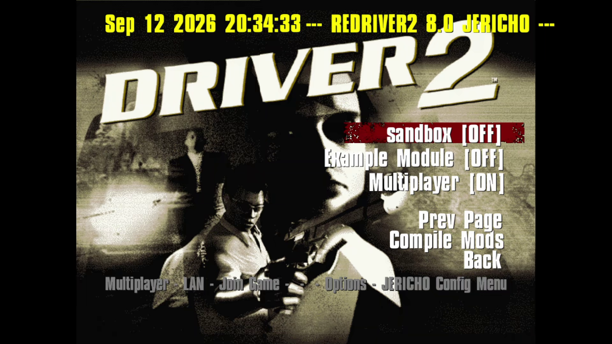
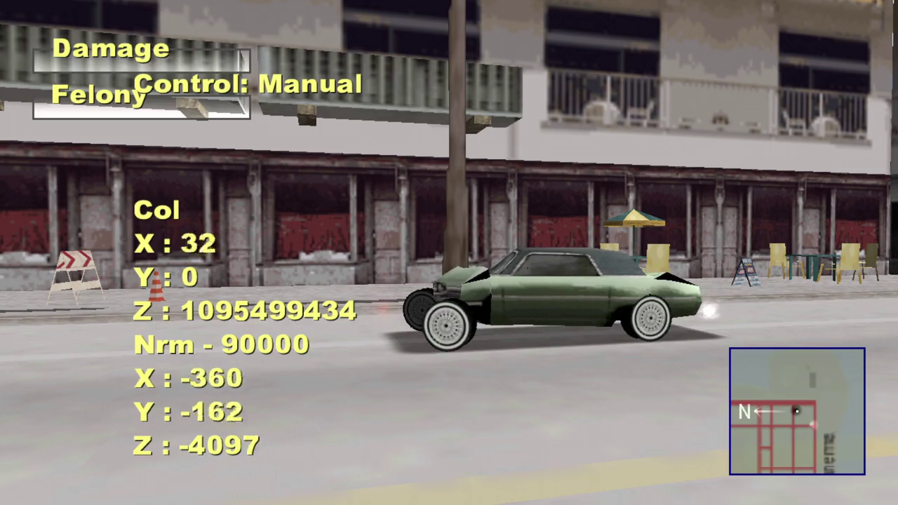
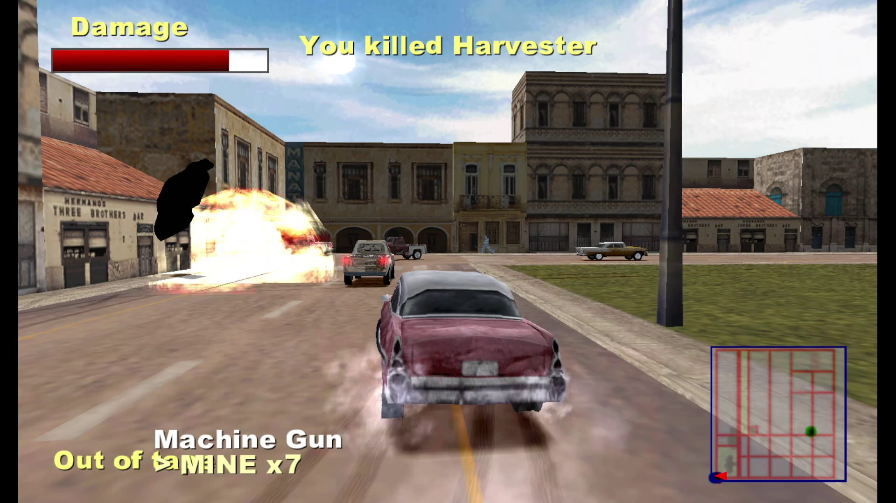
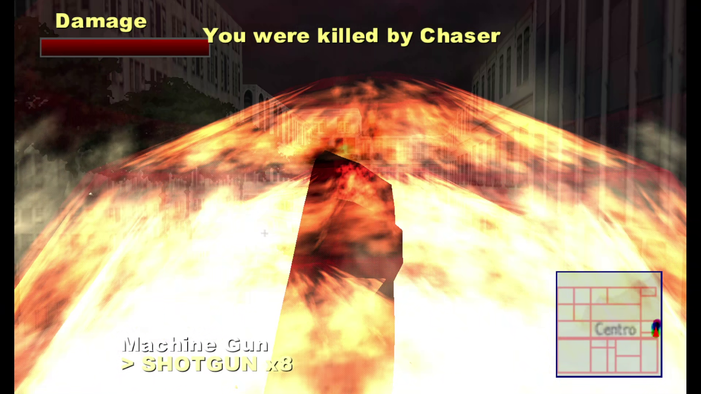
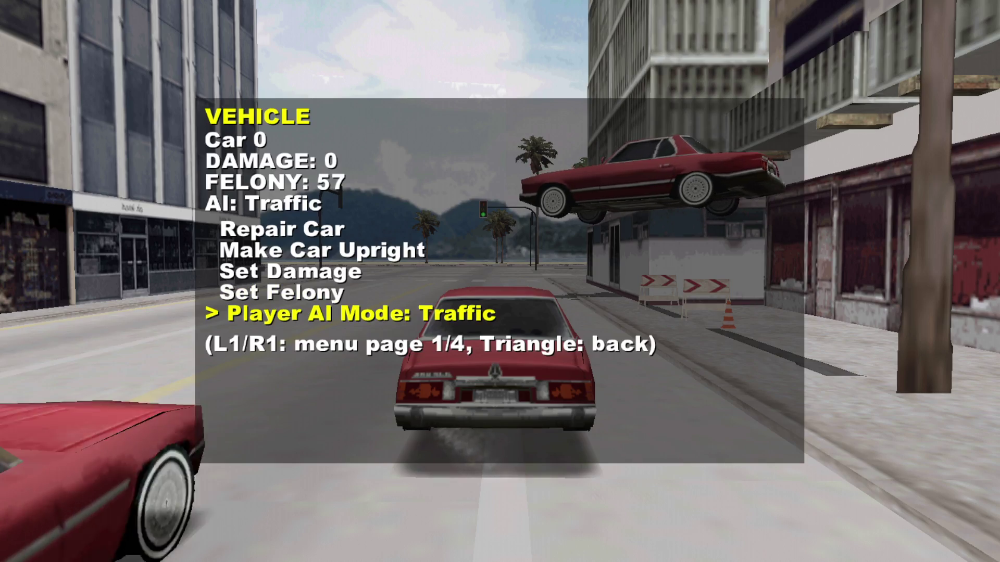

# JERICHO

**Just-in-Time Extensible Runtime Interface for Compiled Hooks & Overrides**

JERICHO is a small, platform-neutral C/C++ mod framework for the
reverse-engineered **REDRIVER2** (a source-level reimplementation of Driver 2).
It turns the game into a *host* for mods: the engine fires named events at the
exact points a mod needs to touch, and modules subscribe to those events through
one stable API. Every engine call site is an **inert no-op when nothing handles
it**, so a stock build with no modules behaves exactly like vanilla REDRIVER2.

This repository is a **REDRIVER2 fork built around JERICHO**. The framework, the
engine-side event bridges, the addon SDK and a set of showcase mods all live
under [`JERICHO/`](JERICHO/) — the mods in [`JERICHO/MODS/`](JERICHO/MODS/) and
the engine-side SDK in [`src_rebuild/Game/C/JERICHO/`](src_rebuild/Game/C/JERICHO/).
The mods exist to *demonstrate what the hook surface makes possible*: real car
deformation, a GTA-style camera, full arcade-handling overhauls, LAN
multiplayer, and more — each one built purely out of hooks plus (for the deep
mods) reads and writes of game globals.

## Two kinds of mods

JERICHO handles mods two ways, and the split is deliberate.

### 1. API addons — runtime DLLs (the primary model)

An **addon** is written against the JERICHO API only and marked `runtime = "dll"`
in its `mod.toml`. It compiles into a DLL **without rebuilding the game**: drop
it into `JERICHO/MODS/<id>/`, press **Compile Mods** in the game (Options →
JERICHO) or run `JERICHO/build_mods.bat`, and the runtime loads it at boot or on
reload. The game executable is never touched — the whole point of JERICHO is
that developers use the API instead of modifying the game.

- The loader scans `JERICHO/MODS`, reads each `mod.toml`, `LoadLibrary`s the
  compiled `<id>.dll` and resolves its entry point (`jer_module_<id>_entry`).
- Enable/disable/reorder at runtime in the Mods menu; the state persists to
  `JERICHO/CONFIG/modlist.ini` (line order = load order, value = enabled).
- Addons build against the standalone SDK in [`JERICHO/sdk/`](JERICHO/sdk/) —
  API headers + the game's import library + `build_mods.bat`. No game source,
  no PsyCross, no SDL/OpenAL/JPEG needed.

### 2. Deep mods — compiled into the game

A **deep mod** patches game internals at the source level: it includes game
headers and reads/writes game globals (`player[]`, `car_data[]`, ...). Because
MSVC cannot import game *data* globals into a DLL, these mods cannot be external
plugins — they are **compiled in** by premake's auto-scan (any folder with a
`mod.toml` that does *not* declare `runtime = "dll"`). The exe exports every
game symbol via [`exports.def`](src_rebuild/exports.def), but only functions are
usable from DLL addons.

Both kinds are managed identically at runtime through the same Mods menu, so the
distinction is about *what a mod is allowed to touch*, not how it is enabled.



*The Mods menu (**Options → JERICHO**): enable, disable and reorder every
installed module, and drop into each module's own page. In-game toggles are
written straight back to `JERICHO/CONFIG/modlist.ini`, and per-module settings
live in `JERICHO/CONFIG/<modid>.ini`.*

## Repository layout

```
JERICHO/                         the framework folder (also the runtime data dir)
├── MODS/<id>/                   installed modules, one folder each
│   ├── mod.toml                 metadata: id, name, version, author, runtime, ...
│   ├── <id>.c                   the module source (addon or deep mod)
│   └── <id>.dll                 compiled addon binary (built, not committed)
├── CONFIG/
│   ├── modlist.ini              module enabled state + load order
│   └── <id>.ini                 per-module settings (jer_config store)
├── build_mods.bat               compiles every runtime="dll" addon (in-game button)
└── sdk/                         standalone addon development kit (headers + import lib)

src_rebuild/Game/C/JERICHO/      the engine-side SDK + canonical docs
├── include/jericho.h            public API: hooks, events, overrides, module entry
├── include/jer_*.h              math / config / menu / pause-menu / net helpers
├── src/jer_loader.c             runtime DLL scanner + loader
├── src/jer_system.c             module table, activation, dispatch, logging
├── src/jer_manager.c            CONFIG/modlist.ini read/write
└── docs/                        the canonical JERICHO documentation
```

Documentation lives beside the code it describes. [`docs/README.md`](docs/README.md)
is the index for the whole set; the canonical JERICHO docs are in
[`src_rebuild/Game/C/JERICHO/docs/`](src_rebuild/Game/C/JERICHO/docs/) —
[`README.md`](src_rebuild/Game/C/JERICHO/docs/README.md) (overview, layout, build),
[`events.md`](src_rebuild/Game/C/JERICHO/docs/events.md) (the full event reference)
and [`HOOKS.md`](src_rebuild/Game/C/JERICHO/docs/HOOKS.md) (writing a module).

## The hook schema

A JERICHO module is a C/C++ source file. The engine discovers it at build time
(deep mods) or at load time (addons) and calls exactly one entry point, which
registers the module and its hooks.

### Registering a module

The entry point is declared with the SDK macro `JER_MODULE_ENTRY`. The game is
C++, so the entry and every symbol it exports must have **C linkage** — the macro
supplies that. The entry name is `jer_module_<id>_entry`, where `<id>` matches
both the folder name and the `mod.toml` id (all three must agree).

```c
#include "jericho.h"
#include "jer_events.h"

JER_MODULE_ENTRY(jer_module_myid_entry)(JERICHO_CONTEXT* ctx)
{
    /* register the module itself: id, name, version, author, description,
     * dependencies ("other,module,ids" or ""), SDK version */
    ctx->jer_register_module(ctx, "myid", "My Module", "1.0.0",
        "You", "What it does.", "", JERICHO_SDK_VERSION);

    /* register an event handler: (event, fn, userdata, priority) */
    ctx->jer_register_hook(ctx, JER_EVENT_FRAME, MyOnFrame, NULL, 0);
}
```

### The hook contract

A handler has the signature `int fn(void* userdata, void* args)`:

- `userdata` is whatever was passed to `jer_register_hook` — use it to give one
  function several roles without global state.
- `args` points at the event's argument struct (`JER_ARGS_*` from
  [`jer_events.h`](src_rebuild/Game/C/jer_events.h) / the SDK copy in
  [`JERICHO/sdk/include/`](JERICHO/sdk/include/)), or is `NULL` for events with
  no payload. Cast it to the type the event documents.
- `priority` orders handlers registered for the same event: **lower runs first**,
  and for shared args the **last return value wins**. Layering a hand
  transformation is just running at a lower/higher priority than another module.
- The return value is one of two `JER_RESULT_*` codes:
  - `JER_RESULT_CONTINUE` — let the remaining handlers (and the engine) run.
  - `JER_RESULT_STOP` — claim/consume the event. For the events that document it,
    the engine then skips its own handling of that input/draw for the frame.

`JERICHO_SDK_VERSION` is the version the module was compiled against; the runtime
checks it and **logs a mismatch**, so a stale addon is obvious rather than silent.
The SDK's [`example/`](JERICHO/MODS/example/) module is a complete, minimal addon
to copy from.

### Notification vs query events

There are two shapes of event, and they change how a handler reads `args`:

- **Notifications** tell a module that something happened and let it mutate the
  args in place (last writer wins) — e.g. `JER_EVENT_FRAME` (once per frame),
  `JER_EVENT_COLLISION` (an impact occurred), or `JER_EVENT_GAME_START` (a level
  is starting, so reset transient state).
- **Queries** let the engine *ask* a module for a value. The engine seeds the
  args struct with the "no module" default (0 / `NULL` / the stock value), fires
  the event, and reads the fields back. A handler that writes a field changes
  engine behaviour; a handler that leaves it alone leaves stock behaviour.

The upshot is the framework's core safety property: because a query's args start
at stock and the engine ignores events nobody handles, **a build with no modules
is byte-for-byte stock behaviour** — the hook call sites are inert.

### The event surface

Events are grouped by the subsystem they bridge. This is the map; the exhaustive
catalogue — every event's argument fields and engine call site — is in
[`events.md`](src_rebuild/Game/C/JERICHO/docs/events.md).

| Area | Events |
|---|---|
| Lifecycle & frame | `JER_EVENT_BOOT`, `JER_EVENT_FRAME`, `JER_EVENT_DEBUG_TICK`, `JER_EVENT_GAME_START`, `JER_EVENT_LEVEL_LAUNCH`, `JER_EVENT_SHUTDOWN` |
| Input | `JER_EVENT_PRE_SIM`, `JER_EVENT_CAR_PAD`, `JER_EVENT_PED_INPUT`, `JER_EVENT_CAMERA_LOOK`, `JER_EVENT_MAP` |
| Car handling | `JER_EVENT_CAR_ENGINE`, `JER_EVENT_CAR_FRICTION`, `JER_EVENT_CAR_STEP`, `JER_EVENT_CAR_TORQUE`, `JER_EVENT_CAR_DRAW`, `JER_EVENT_CAR_DRAW_COLOR`, `JER_EVENT_GET_PHYSICS_PARAMS` |
| Damage & collision | `JER_EVENT_COLLISION`, `JER_EVENT_DENT_PASS`, `JER_EVENT_RESET_CAR`, `JER_EVENT_CAR_VS_CAR`, `JER_EVENT_GET_DAMAGE_SCALE`, `JER_EVENT_GET_WALL_RESTITUTION`, `JER_EVENT_GET_BUDDHA` |
| Wheels | `JER_EVENT_GET_WHEEL_BEND`, `JER_EVENT_GET_WHEEL_DAMAGE`, `JER_EVENT_GET_WHEEL_PARAMS`, `JER_EVENT_DRAW_WHEEL` |
| Engine sound | `JER_EVENT_CAR_GEARBOX`, `JER_EVENT_CAR_REVS`, `JER_EVENT_CAR_ENGINE_SOUND` |
| Explosions & overlay | `JER_EVENT_EXPLOSION_SPAWN`, `JER_EVENT_EXPLOSION_DRAW`, `JER_EVENT_EXPLOSION_COLLIDE`, `JER_EVENT_DRAW_OVERLAY`, `JER_EVENT_DRAW_WORLD` |
| Camera | `JER_EVENT_CAMERA` |
| Ped & animation | `JER_EVENT_PED_MOVE`, `JER_EVENT_PED_POSE`, `JER_EVENT_PED_SKELETON` |
| Frontend & menus | `JER_EVENT_FRONTEND`, `JER_EVENT_PAUSE_MENU`, `JER_EVENT_MP_FRONTEND` |
| Map | `JER_EVENT_MAP`, `JER_EVENT_DRAW_MAP` |
| Levels & vehicles | `JER_EVENT_CAR_AVAILABILITY`, `JER_EVENT_CAR_DATA_SOURCE` |
| Networking | `JER_EVENT_NET_INPUT`, `JER_EVENT_NET_CAR_STATE`, `JER_EVENT_NET_PLAYERS`, `JER_EVENT_NET_RECV`, `JER_EVENT_NET_SPAWN` |
| Custom | `>= JER_EVENT_MODULE_CUSTOM` (free for module-to-module messaging) |

### What a module can do besides events

Events are the core, but the API ships a helper for everything a mod usually
needs. All are declared in the SDK headers under
[`JERICHO/sdk/include/`](JERICHO/sdk/include/):

| Header | Gives you |
|---|---|
| `jer_pause_menu.h` | Register menus/submenus into the pause screen (`jer_pause_menu_register`). The engine collects them under a **Modules** submenu (`Continue → Modules → your menu`), supports live dynamic labels and Left/Right adjust items, and needs no `pause.c` edits. |
| `jer_frontend.h` | Register **real frontend screens** the engine renders natively (`jer_frontend_register_menu`), optionally routed from the main menu (`jer_frontend_set_main_entry`). The multiplayer mod's menus are built this way. |
| `jer_hud.h` | On-screen HUD messages (`jer_hud_message`, drawn via `jer_hud_draw`). |
| `jer_config.h` | Persistent per-module settings (`jer_config_get_int`/`set_int`/…). Each module owns `JERICHO/CONFIG/<modid>.ini`, hand-editable while the game is closed. |
| `jer_net.h` | A named-channel network bridge over the active multiplayer session (`jer_net_register_channel` + `jer_net_send`, delivered back as `JER_EVENT_NET_RECV`). A safe no-op with no session, so a module can call it unconditionally. |
| `jer_anim.h` | Player-skeleton animation helpers (resolve bones when posing via `JER_EVENT_PED_POSE` / `JER_EVENT_PED_SKELETON`). |
| `jer_npc.h` | NPC (pedestrian) helpers. |
| `jer_math.h` | Shared math helpers. |

Two escape hatches round out the API:

- **Behaviour overrides** — `ctx->jer_override(ctx, SLOT, fn)` swaps an engine
  function-pointer slot (today `JER_OVERRIDE_SLOT_SIM`, the world step);
  `jer_get_override(slot)` returns the previous handler so modules can chain.
  The sandbox's time-scale is built on this.
- **Custom events** — any id `>= JER_EVENT_MODULE_CUSTOM` is free for
  module-to-module messaging; fire and consume them exactly like stock events.

### Logging

`ctx->jer_log(ctx, fmt, ...)` routes through the JERICHO logger, which the game
writes into **`REDRIVER2.log`** (and the console in `_DEBUG` builds). At boot the
runtime prints a banner and a module/hook inventory, so a missing log line is the
first sign a module isn't compiled in or is disabled. Prefix your lines with
`[<id>]` to keep the inventory readable.

### A complete, minimal addon

A whole working addon is two files — this is the shape of the in-repo
[`example`](JERICHO/MODS/example/) module.

`JERICHO/MODS/greet/mod.toml`:

```toml
id = "greet"
name = "Greet"
version = "0.1.0"
author = "You"
description = "Logs a line every 60 frames."
default-enabled = true
runtime = "dll"          # REQUIRED: marks this a runtime DLL addon
```

`JERICHO/MODS/greet/greet.c`:

```c
#include "jericho.h"

static int GreetOnFrame(void* userdata, void* args)
{
    static int n = 0;
    JERICHO_CONTEXT* ctx = (JERICHO_CONTEXT*)userdata;
    if ((++n % 60) == 0)
        ctx->jer_log(ctx, "[greet] frame %d", n);
    return JER_RESULT_CONTINUE;
}

JER_MODULE_ENTRY(jer_module_greet_entry)(JERICHO_CONTEXT* ctx)
{
    ctx->jer_register_module(ctx, "greet", "Greet", "0.1.0",
        "You", "Logs a line every 60 frames.", "", JERICHO_SDK_VERSION);
    /* pass ctx as userdata so the handler can log through the API */
    ctx->jer_register_hook(ctx, JER_EVENT_FRAME, GreetOnFrame, ctx, 0);
}
```

Build it (`JERICHO\build_mods.bat greet`) and enable **Greet** in Options →
JERICHO. The id, the folder name and the entry symbol all read `greet`.

## Building and running

### Prerequisites (Windows)

- **Visual Studio 2019 or 2022** with the **Desktop development with C++**
  workload (the MSVC x64 toolset and MSBuild).
- **`premake5.exe`** — already committed at the repo root.
- The third-party dependencies (SDL2, OpenAL, libjpeg), pinned to the upstream
  versions (SDL2 `2.30.2`, OpenAL-soft `1.23.1`, libjpeg `jpeg-9d`). Fetch them
  once with [`windows_dev_prepare.ps1`](windows_dev_prepare.ps1).

### Building the game

Generate the Visual Studio solution, then build it:

```
premake5.exe vs2019
msbuild build\REDRIVER2.sln /p:Configuration=Release /p:Platform=x64
```

Helpers exist for the common cases:
[`src_rebuild/build_redriver2.bat`](src_rebuild/build_redriver2.bat) (Release) and
[`src_rebuild/build_dev.bat`](src_rebuild/build_dev.bat) (`Release_dev`).

- **premake auto-scans `JERICHO/MODS`**: every folder with a `mod.toml` that does
  *not* declare `runtime = "dll"` (a deep mod) is compiled into the game — there
  is no mod list to maintain. `--with-mods="crumple,combatd2"` builds only a
  subset; `--with-mods=""` gives a zero-mods build.
- **Configurations:** `Release` is the clean shipping build; `Release_dev` adds
  the debug options, console and dev tooling (`DEBUG_OPTIONS`, `COLLISION_DEBUG`,
  `CUTSCENE_RECORDER`).
- The executable exports its own symbols through the generated
  [`exports.def`](src_rebuild/exports.def). Regenerate it (build with `/MAP`, then
  run `tools/gen_exports`) only when the game's own symbol set changes.

### Building addons (no exe rebuild)

Addons build separately, against the game's import library, into DLLs:

```
JERICHO\build_mods.bat
```

Or press **Compile Mods** in the game (Options → JERICHO). Either way the script
generates the addon solution ([`premake5_mods.lua`](src_rebuild/premake5_mods.lua)
→ one DLL project per `runtime = "dll"` mod), builds it against the exported
symbols, and copies the DLLs next to the executable. Reloading the Mods screen
activates them; the game exe is never rebuilt.

To build a single addon from its own folder, without the game tree:

```
JERICHO\sdk\build_mods.bat myaddon
```

The standalone SDK ([`JERICHO/sdk/`](JERICHO/sdk/)) ships the API headers, the
game import library (`REDRIVER2.lib`) and the compiler glue, so addon authors
need no game source, no PsyCross and no SDL/OpenAL/JPEG.

> **Addon vs deep mod at build time.** Only `runtime = "dll"` folders become
> DLLs; a folder *without* that key is compiled into the game and needs a full
> game build. An addon that links a game *data* global (`?player@@...`) will fail
> — MSVC cannot import data globals into a DLL, so keep addons API-only and move
> game-internal code into a deep mod.

### Installing and enabling mods

Drop a module's folder (its `mod.toml` plus, for an addon, the built `<id>.dll`)
into `JERICHO/MODS/<id>/`, then enable it in-game under **Options → JERICHO**.
The loader scans `JERICHO/MODS` at boot and on every reload of the Mods screen.

- **Enabled state and load order** live in
  [`JERICHO/CONFIG/modlist.ini`](JERICHO/CONFIG/modlist.ini): line order = load
  order, the value is the enabled flag (`1`/`0`). A module *not* listed there
  follows its `default-enabled` flag from `mod.toml`, so a fresh checkout runs
  each mod's default.
- **Per-module settings** live in `JERICHO/CONFIG/<modid>.ini` (the
  `jer_config.h` store) and can be hand-edited while the game is closed.
- The active modules are listed in **`REDRIVER2.log`** at boot. A module missing
  from the inventory is either not installed, disabled, or (for an addon) not yet
  compiled.

### Prebuilt downloads

Every push to `main` and every `v*` tag is built by GitHub Actions and published
as downloadable archives: a Windows x86 build and a Linux x86_64 build, each in
`Release` and `Release_dev`, packed with the runtime libraries, the `data/` tree
and the `JERICHO/` tree the runtime reads. See [`docs/CI.md`](docs/CI.md) for
what is produced and how a release is cut.

### Linux and other platforms

- **Linux:** [`linux_dev_prepare.sh`](linux_dev_prepare.sh) fetches premake and
  runs `premake5 gmake2`; then `make config=release_x64` in `src_rebuild/build/`.
- **Multiarch Docker:** [`Dockerfile`](Dockerfile) + [`dockerbuild.sh`](dockerbuild.sh).
- Deep mods build everywhere. Runtime addon DLLs load on Windows (`LoadLibrary`)
  and Linux (`dlopen`); on Emscripten/Android the loader is a stub, so addons are
  ignored (and logged) while deep mods still work.

### Debug boot arguments

`Release_dev` builds accept frontend-bypass launch arguments for fast iteration:

```
REDRIVER2_dev.exe -nointro -nofmv -level <city> -car <slot#> -gamemode <mode>
                 -time <time> -weather <weather>
```

- `-level`: `chicago` / `havana` / `lasvegas` / `rio`
- `-car`: a slot number (0–9) or a car name
- `-gamemode`: `takeadrive` (default) / `survival` / `pursuit` / …
- `-time`: `day` / `dusk` / `night`; `-weather`: `sunny` / `rain`

`-car` needs at least a `-level` (a message box explains otherwise).

## Showcase mods

These modules exist to demonstrate what the hook surface makes possible. Each is
built purely from JERICHO events (plus, for the deep mods, read/write access to
game globals), each is managed from the same Mods menu, and none of them edits
engine files — remove a module and the game is stock. Each mod also ships a fuller
`README.md` in its own folder under [`JERICHO/MODS/`](JERICHO/MODS/) with the
exact event list and tuning notes.

### CRUMPLE — car deformation

The flagship package: impact-driven vertex deformation and wheel damage layered
on the stock damaged-model system. **Uses:** `JER_EVENT_COLLISION` /
`JER_EVENT_DENT_PASS` / `JER_EVENT_RESET_CAR` to record impacts and deform verts,
`JER_EVENT_GET_WHEEL_BEND` / `GET_WHEEL_DAMAGE` / `GET_WHEEL_PARAMS` +
`JER_EVENT_DRAW_WHEEL` for per-wheel bend and scrub, and `JER_EVENT_PAUSE_MENU` /
`JER_EVENT_GET_IMPACT_INFO` for its **Crumple Debug** submenu and readout.



### Caine's Crossfire (`combatd2`) — car combat

Twisted Metal: Black-style arcade handling on a point-mass body, with a weapon
prototype and a parametric explosion-FX library. **Uses:** the full car-handling
set (`CAR_PAD`, `CAR_ENGINE`, `CAR_FRICTION`, `CAR_TORQUE`, `CAR_STEP`,
`CAR_DRAW`, `CAR_DRAW_COLOR`, `CAR_GEARBOX`, `CAR_REVS`, `CAR_ENGINE_SOUND`); the
damage hooks (`CAR_VS_CAR`, `GET_DAMAGE_SCALE`, `GET_WALL_RESTITUTION`); the FX
hooks (`EXPLOSION_SPAWN` / `DRAW` / `COLLIDE`, `DRAW_WORLD`); plus `DRAW_MAP`,
`CAR_DATA_SOURCE`, `CAR_AVAILABILITY` and `LEVEL_LAUNCH`. The single best example
of how far one mod can reshape handling, sound, damage and effects at once.





### Sandbox — the whole API surface

A demo package: no-damage, a time-scale world-step override, a map-teleport
cursor, and an overlay menu that keeps the world running while it's open.
**Uses:** `JER_EVENT_FRAME` (no-damage), the `JER_OVERRIDE_SLOT_SIM` override
(time-scale), `JER_EVENT_DRAW_OVERLAY` + `JER_EVENT_PAUSE_MENU` (its menu),
`JER_EVENT_MAP` (the teleport cursor), and a custom `>= JER_EVENT_MODULE_CUSTOM`
event for its no-damage toggle — pure hooks, zero vanilla edits.



### Driver 2 Parallel Lines (`d2pl`) — camera + weapons

A modern dual-stick third-person camera plus an overridable weapon system.
**Uses:** `JER_EVENT_CAMERA` (orbit / framing / FOV), `JER_EVENT_CAMERA_LOOK`
(right-stick look), `JER_EVENT_PED_INPUT` + `PED_MOVE` / `PED_POSE` /
`PED_SKELETON` (on-foot, camera-relative movement), `JER_EVENT_PAUSE_MENU`, and
`jer_config` for its settings.

### COLLISIONDEVIL — arcade handling

An arcade handling overhaul ("a rocket-powered skateboard") that derives every
value from existing chassis stats. **Uses:** `JER_EVENT_CAR_ENGINE` (scale
thrust + steering), `JER_EVENT_CAR_FRICTION` (drop rear grip), `JER_EVENT_CAR_STEP`
(detect drift), `JER_EVENT_CAR_TORQUE` (inject yaw kick) and `JER_EVENT_CAR_DRAW`
(render-only body drama). Shows the handling hooks used as a coherent set.

### AI Driver (`aidriver`) — a runtime addon

A general-purpose AI driver for the player's car, built as an **addon DLL** (no
game rebuild). **Uses:** `JER_EVENT_FRAME` and `JER_EVENT_PRE_SIM` to observe and
drive the car, reading the AI mode from a game global — zero cross-module
coupling. The clearest demonstration of the addon model.

### Ant Farm — a screensaver / idle mode

Turns the game into a passive city observer: input cut, HUD hidden, SFX muted,
cops passive, while a cinematic camera tours the map. **Uses:** `JER_EVENT_CAMERA`
for its shot styles, plus `JER_EVENT_FRAME`, `JER_EVENT_PED_INPUT`,
`JER_EVENT_DRAW_OVERLAY` and `JER_EVENT_PAUSE_MENU`.

### Level Hacks (`levelhacks`) — frontend flow

Intercepts take-a-ride after the city confirm and offers Singleplayer/Multiplayer,
then can boot a city's small multiplayer map in single player. **Uses:**
`JER_EVENT_FRONTEND` (defer the stock start and run its own menu),
`JER_EVENT_FRAME` (drive the menu), `JER_EVENT_DRAW_OVERLAY` (draw it),
`JER_EVENT_GAME_START` (re-arm) and `JER_EVENT_LEVEL_LAUNCH` (swap the pending
mission number). Shows rewriting frontend flow and the level-launch args.

### Multiplayer (`mp`) — networking

LAN multiplayer: host/join with UDP discovery, real frontend menus, and
synchronized play. **Uses:** `JER_EVENT_MP_FRONTEND` (claim the menu),
`JER_EVENT_FRONTEND` / `LEVEL_LAUNCH` / `GAME_START` (session flow), the net hooks
(`NET_INPUT`, `NET_RECV`, `NET_SPAWN`, and the `NET_CAR_STATE` / `NET_PLAYERS`
resync path), the `jer_frontend.h` menu API and the `jer_net.h` channel bridge.
The reference for the networking and frontend-menu surfaces.

### Example (`example`) — the smoke test

The minimal reference addon: logs at boot and fires a custom event every 60
frames. **Uses:** `JER_EVENT_FRAME` plus a custom `JER_EVENT_MODULE_CUSTOM`
event. It exists to prove the whole addon pipeline end to end — the copy-me
starting point.

## Credits

**JERICHO and this fork — Jaret Ludvik.**

This project stands on **REDRIVER2**, the reverse-engineered Driver 2 rewrite it
is forked from, and the engine underneath is the work of its authors: **SoapyMan**
(lead reverse engineer and programmer), **Fireboyd78** (code refactoring and
improvements), **Krishty** and **someone972** (early format decoding),
**Gh0stBlade** (the HLE emulator base for Psy-Cross), **Ben Lincoln** (*(TDR)* —
This Dust Remembers What It Once Was) and **Stohrendorf** (the symdump utility).
The upstream project and its full history live in [`REDRIVER2.md`](REDRIVER2.md).

Some bundled mods carry their own authorship in their `mod.toml` / folder
README — see [`JERICHO/MODS/`](JERICHO/MODS/).

## Documentation

- [`docs/README.md`](docs/README.md) — the index for the whole documentation set.
- [`src_rebuild/Game/C/JERICHO/docs/README.md`](src_rebuild/Game/C/JERICHO/docs/README.md) — JERICHO overview (layout, build, runtime).
- [`src_rebuild/Game/C/JERICHO/docs/events.md`](src_rebuild/Game/C/JERICHO/docs/events.md) — the exhaustive event reference.
- [`src_rebuild/Game/C/JERICHO/docs/HOOKS.md`](src_rebuild/Game/C/JERICHO/docs/HOOKS.md) — writing a module.
- [`JERICHO/sdk/README.md`](JERICHO/sdk/README.md) — the addon SDK.
- [`docs/CI.md`](docs/CI.md) — the builds, downloads and release process.
