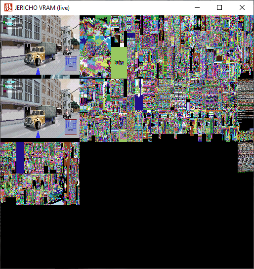
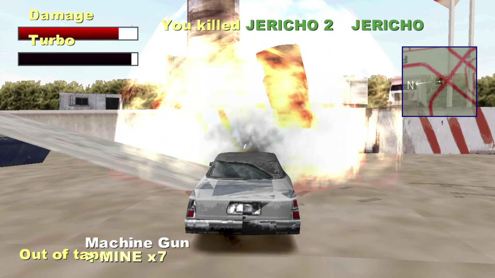
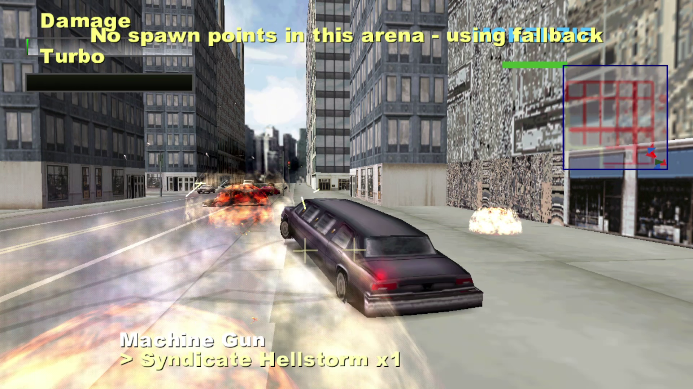
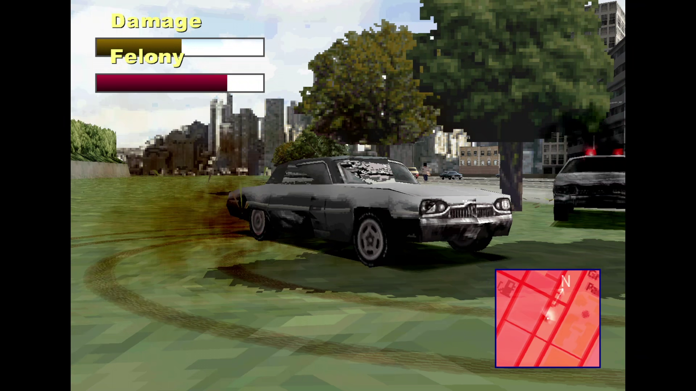
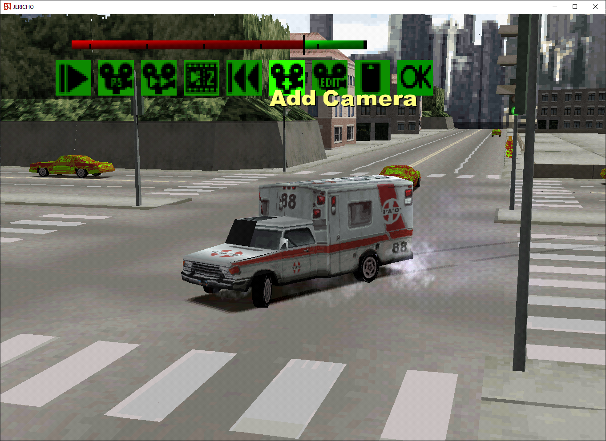

# JERICHO

Junction Engine Runtime for Intercepted Calls, Hooks and Overrides.

JERICHO is a mod host built into a fork of [OpenDriver2/REDRIVER2](REDRIVER2.md),
a source-level reimplementation of Driver 2. It is not a library you drop onto
someone else's build — the call sites live in the engine's own functions, and
this tree carries them.


*The Mods menu (**Options → JERICHO**): enable, disable and reorder every
installed module, and drop into each module's own page. In-game toggles are
written straight back to `JERICHO/CONFIG/modlist.ini`, and per-module settings
live in `JERICHO/CONFIG/<modid>.ini`.*

| I want to… | Start here |
|---|---|
| Run a build | [Building and running](#building-and-running) |
| Write an external module | [`HOOKS.md`](src_rebuild/Game/C/JERICHO/docs/HOOKS.md) |
| Look up an event | [`events.md`](src_rebuild/Game/C/JERICHO/docs/events.md) |

## Stock means behavioral, not byte-for-byte

A build with no modules runs no mod code. That is the whole of it. It is **not**
an unmodified REDRIVER2 binary: the hook call sites stay compiled in, and the
linker still emits them.

- `jer_fire` returns immediately only when the global handler count is zero.
  Loading any module makes every call site walk the handler table, including
  events nobody subscribed to.
- Disabling a compiled-in module skips its handlers; it does not unlink them.
- Removing an external library and reloading drops its hooks and override slots.

None of these reproduces a byte-for-byte stock executable.

## Two ways a module is joined

Both kinds are a folder under `JERICHO/MODS/<id>/` with a `mod.toml`, both
register through the same entry point (`jer_module_<id>_entry`), and both are
toggled from the same Mods menu. What differs is how the module joins the
process.

- **compiled-in** — a module the premake scan builds into the game executable.
  Today this is any `JERICHO/MODS/<id>/` folder whose `mod.toml` does not set
  `runtime = "dll"`.
- **external** — a shared library the host loads at boot. Today this is
  `runtime = "dll"`.

The `runtime = "dll"` key is the current marker; the words this README uses are
**compiled-in** and **external**.

JERICHO is compiled into the game, so it can see the game's data. An external
module cannot open `player[]` or `car_data[]` itself, because Windows will not
let a separate library import those data globals; it can only do what an event
or a helper already carries across. A compiled-in module may include engine
headers and write those globals. **CRUMPLE is compiled-in for that reason.**
This is a linker limit, not a depth ranking.

Composition, when several modules are active:

- Handlers for one event run in **ascending priority — lower first**.
- The **last writer of a shared out-param wins**, unless a handler returns
  `JER_RESULT_STOP`.
- Two modules on the same out-param **do not merge**.
- `dependencies` means the dependency is **present and enabled**, not
  initialised first.
- Load order is **`modlist.ini` line order**.

## Limits

These are the numbers and behaviours the headers define.

| Limit | Behaviour |
|---|---|
| Event handlers | **256** across every module; registering past that returns without a log |
| Override slots | **8**; only `JER_OVERRIDE_SLOT_SIM` (the world step) is named today |
| Module table | fixed (`JER_MAX_MODULES`, 32 slots) |
| External loading | Windows and Linux |
| Emscripten, Android | the loader is a stub, so external modules are ignored; compiled-in modules still build |
| In-game **Compile Mods** | needs the toolchain that built the fork |
| Native code | runs in-process — a bad handler owns the process |

Builds and modules are native code; install them from people you trust, at your
own risk.

## Repository layout

```
JERICHO/                         the framework folder (also the runtime data dir)
├── MODS/<id>/                   installed modules, one folder each
│   ├── mod.toml                 metadata: id, name, version, author, runtime, ...
│   ├── <id>.c                   the module source (compiled-in or external)
│   ├── textures/<name>.tga      the module's own art (jer_texture)
│   └── <id>.dll                 compiled external library (built, not committed)
├── CORE/                        JERICHO's own art (the custom menu background)
├── CONFIG/                      modlist.ini, jericho.ini, per-module <id>.ini
└── sdk/                         standalone external-module development kit

src_rebuild/Game/C/JERICHO/      the engine-side SDK
├── include/jericho.h            public API: hooks, events, overrides, module entry
├── include/jer_*.h              math/config/menu/screen/texture/map/... helpers
├── src/jer_*.c                  the runtime (loader, dispatch, config, modlist)
└── docs/                        the engine-side docs
```

[`docs/README.md`](docs/README.md) is the index for the whole documentation set.
The engine-side docs begin at
[`src_rebuild/Game/C/JERICHO/docs/README.md`](src_rebuild/Game/C/JERICHO/docs/README.md),
with [`events.md`](src_rebuild/Game/C/JERICHO/docs/events.md) (the event
reference), [`HOOKS.md`](src_rebuild/Game/C/JERICHO/docs/HOOKS.md) (writing a
module) and [`textures.md`](src_rebuild/Game/C/JERICHO/docs/textures.md) (custom
art) as the entry points.

## Writing a module

A module is one C/C++ source file plus a `mod.toml`. The engine calls exactly
one entry point, `jer_module_<id>_entry`, where `<id>` matches both the folder
name and the `mod.toml` id. The whole of a working external module is two files:

`JERICHO/MODS/greet/mod.toml`:

```toml
id = "greet"
name = "Greet"
version = "0.1.0"
author = "You"
description = "Logs a line every 60 frames."
default-enabled = true
runtime = "dll"          # marks this an external module
```

`JERICHO/MODS/greet/greet.c`:

```c
#include "jericho.h"

static int GreetOnFrame(void* userdata, void* args)
{
    static int n = 0;
    JERICHO_CONTEXT* ctx = (JERICHO_CONTEXT*)userdata;
    if ((++n % 60) == 0)
        ctx->jer_log(ctx, "[greet] frame %d", n);
    return JER_RESULT_CONTINUE;
}

JER_MODULE_ENTRY(jer_module_greet_entry)(JERICHO_CONTEXT* ctx)
{
    ctx->jer_register_module(ctx, "greet", "Greet", "0.1.0",
        "You", "Logs a line every 60 frames.", "", JERICHO_SDK_VERSION);
    /* pass ctx as userdata so the handler can log through the API */
    ctx->jer_register_hook(ctx, JER_EVENT_FRAME, GreetOnFrame, ctx, 0);
}
```

The full walkthrough — module anatomy, pause menus, on-screen messages,
logging, boot arguments — is
[`HOOKS.md`](src_rebuild/Game/C/JERICHO/docs/HOOKS.md).

## Custom textures and art

A module ships its own art as a 32-bit TGA under `JERICHO/MODS/<id>/textures/`,
loads it with the
[`jer_texture.h`](src_rebuild/Game/C/JERICHO/include/jer_texture.h) API and draws
it; the engine owns the loading, the upload, the page maths, the ordering table
and the draw order. The full write-up — the two targets, the three draw calls
and the traps the API hides — is
[`textures.md`](src_rebuild/Game/C/JERICHO/docs/textures.md).



## Building and running

### Prerequisites (Windows)

- **Visual Studio 2019 or 2022** with the **Desktop development with C++**
  workload (the MSVC x64 toolset and MSBuild).
- **`premake5.exe`** — committed at the repo root.
- The third-party dependencies (SDL2, OpenAL, libjpeg), pinned to the upstream
  versions (SDL2 `2.30.2`, OpenAL-soft `1.23.1`, libjpeg `jpeg-9d`). Fetch them
  once with [`windows_dev_prepare.ps1`](windows_dev_prepare.ps1).

### Building the game

```
premake5.exe vs2019
msbuild build\JERICHO.sln /p:Configuration=Release /p:Platform=x64
```

Helpers: [`src_rebuild/build_jericho.bat`](src_rebuild/build_jericho.bat)
(Release) and [`src_rebuild/build_dev.bat`](src_rebuild/build_dev.bat)
(`Release_dev`).

- premake **auto-scans `JERICHO/MODS`**: every folder with a `mod.toml` that
  does *not* declare `runtime = "dll"` is compiled into the game — there is no
  mod list to maintain. `--with-mods="crumple,carhacks"` builds a subset;
  `--with-mods=""` gives a zero-module build.
- `Release` is the clean shipping build; `Release_dev` adds the debug options,
  console and dev tooling (`DEBUG_OPTIONS`, `COLLISION_DEBUG`,
  `CUTSCENE_RECORDER`).
- The executable exports its own symbols through the generated
  [`exports.def`](src_rebuild/exports.def). Regenerate it (build with `/MAP`,
  then run `tools/gen_exports`) only when the game's own symbol set changes.

### Building external modules

External modules build separately, against the game's import library, into a
shared library (`.dll` on Windows, `.so` on Linux):

```
JERICHO\build_mods.bat
```

Or press **Compile Mods** in the game (Options → JERICHO). Either way the script
generates the module solution
([`premake5_mods.lua`](src_rebuild/premake5_mods.lua) → one project per
`runtime = "dll"` folder), builds it against the exported symbols, and copies
the result next to the executable. Reloading the Mods screen activates them.

To build a single module from its own folder, without the game tree:

```
JERICHO\sdk\build_mods.bat mymodule
```

The standalone SDK ([`JERICHO/sdk/`](JERICHO/sdk/)) ships the API headers, the
game import library (`JERICHO.lib`) and the compiler glue, so a module author
needs no game source, no PsyCross and no SDL/OpenAL/JPEG.

> **At build time.** Only `runtime = "dll"` folders become external libraries;
> a folder *without* that key is compiled into the game and needs a full game
> build. An external module that links a game *data* global (`?player@@...`)
> will fail — a separate library cannot import data globals — so keep external
> modules API-only and move game-internal code into a compiled-in module.

### Installing and enabling modules

Drop a module's folder (its `mod.toml`, plus the built library for an external
module) into `JERICHO/MODS/<id>/`, then enable it in-game under
**Options → JERICHO**. The loader scans `JERICHO/MODS` at boot and on every
reload of the Mods screen.

- **Enabled state and load order** live in
  [`JERICHO/CONFIG/modlist.ini`](JERICHO/CONFIG/modlist.ini): line order = load
  order, the value is the enabled flag (`1`/`0`). A module *not* listed there
  follows its `default-enabled` flag from `mod.toml`.
- **Per-module settings** live in `JERICHO/CONFIG/<modid>.ini` (the
  `jer_config.h` store) and can be hand-edited while the game is closed.
- The active modules are listed in **`JERICHO.log`** at boot; how a module
  gets enabled, and the `-nomods` / forced-module switches, are in
  [`module-activation.md`](src_rebuild/Game/C/JERICHO/docs/module-activation.md).

### Prebuilt downloads

Every push to `main` and every `v*` tag is built by GitHub Actions and published
as downloadable archives: a Windows x86 build and a Linux x86_64 build, each in
`Release` and `Release_dev`, packed with the runtime libraries, the `data/` tree
and the `JERICHO/` tree the runtime reads. See [`docs/CI.md`](docs/CI.md).

### Linux and other platforms

- **Linux:** [`linux_dev_prepare.sh`](linux_dev_prepare.sh) fetches premake and
  runs `premake5 gmake2`; then `make config=release_x64` in `src_rebuild/build/`.
- **Multiarch Docker:** [`Dockerfile`](Dockerfile) + [`dockerbuild.sh`](dockerbuild.sh).
- Compiled-in modules build everywhere. External modules load on Windows and
  Linux; on Emscripten and Android the loader is a stub, so external modules are
  ignored (and logged) while compiled-in modules still work.

### Boot arguments and dev tooling

- **Debug boot arguments** (`-level`, `-car`, `-gamemode`, `-nomods`,
  `-testmode`, `-shot`, …) are documented in
  [`HOOKS.md`](src_rebuild/Game/C/JERICHO/docs/HOOKS.md) and printed by
  `JERICHO_dev.exe -help`.
- **Repo-wide tools** — release publishing and crash-dump triage — are in
  [`tools/README.md`](tools/README.md); each module ships its own workbench in
  its folder.

## Showcase

These modules exist to show what the hook surface can reach. Each is either
compiled-in or external, each is managed from the same Mods menu, and each ships
a fuller `README.md` in its own folder under [`JERICHO/MODS/`](JERICHO/MODS/).

### CRUMPLE (`crumple`) — car deformation *(compiled-in)*

Impact-driven vertex deformation and wheel damage layered on the stock
damaged-model system. [README](JERICHO/MODS/crumple/README.md)


### Caine's Crossfire (`cainescrossfire`) — car combat *(compiled-in)*

Twisted Metal: Black-style arcade handling, a weapon arsenal, mounted crew and a
parametric explosion-FX library, with its own arenas.
[README](JERICHO/MODS/cainescrossfire/README.md)






### Car Hacks (`carhacks`) — every vehicle, from any city *(compiled-in)*

Unlocks the extra vehicles the frontend hides and loads another city's vehicles
into a level's resident slots — a Chicago school bus in Havana, a Rio truck in
Vegas. [README](JERICHO/MODS/carhacks/README.md)





### Sandbox (`sandbox`) — the whole API surface *(compiled-in)*

A demo package: no-damage, a time-scale world-step override, a map-teleport
cursor and an overlay menu that keeps the world running while it is open.
[README](JERICHO/MODS/sandbox/README.md)


### Driver 2 Parallel Lines (`d2pl`) — camera + weapons *(compiled-in)*

A modern dual-stick third-person camera plus an overridable weapon system.
*(Development is currently paused.)* [readme](JERICHO/MODS/d2pl/readme.md)

### COLLISIONDEVIL (`collisiondevil`) — arcade handling *(compiled-in)*

An arcade handling overhaul that derives every value from existing chassis
stats. [README](JERICHO/MODS/collisiondevil/README.md)

### AI Driver (`aidriver`) — a runtime AI driver *(external)*

A general-purpose AI driver for the player's car, built against the API alone.
[README](JERICHO/MODS/aidriver/README.md)

### Ant Farm (`antfarm`) — a screensaver / idle mode *(compiled-in)*

Turns the game into a passive city observer: input cut, HUD hidden, SFX muted,
cops passive, while a cinematic camera tours the map.
[readme](JERICHO/MODS/antfarm/readme.md)

### Level Hacks (`levelhacks`) — frontend flow *(compiled-in)*

Intercepts take-a-ride after the city confirm and can boot a city's small
multiplayer map in single player. [README](JERICHO/MODS/levelhacks/README.md)

### Multiplayer (`mp`) — networking *(compiled-in)*

LAN multiplayer: host/join with UDP discovery, real frontend menus and
synchronized play. [README](JERICHO/MODS/mp/README.md)

### Test Mode (`testmode`) — the asset-test harness *(compiled-in)*

Cuts the world down to a quiet backdrop and drops a free orbit camera on a
chosen car or on Tanner. [README](JERICHO/MODS/testmode/README.md)

### Debug Orbit Camera (`debugorbit`) — camera-only inspector *(external)*

Takes the camera over at level start and orbits the player at a fixed radius and
elevation. [README](JERICHO/MODS/debugorbit/README.md)

### Yaris Bounce (`yarisbounce`) — a render-only gimmick *(compiled-in)*

Squash-and-stretch the car body's vertex copy as it drives, drawn without
touching physics or collision. [JERICHO/MODS/yarisbounce/](JERICHO/MODS/yarisbounce/)

### GAILDRV2 (`gaildrv2`) — the machine-learning bridge *(compiled-in)*

A JERICHO ↔ ML bridge: it exports game state over TCP as compact binary and
applies agent actions. [README](JERICHO/MODS/gaildrv2/README.md)

### Example (`example`) — the smoke test *(external)*

The minimal reference module: logs at boot and fires a custom event every 60
frames. [README](JERICHO/MODS/example/README.md)

## Credits

**JERICHO and this fork — Jaret Ludvik.**

This project stands on **REDRIVER2**, the reverse-engineered Driver 2 rewrite it
is forked from, and the engine underneath is the work of its authors: **SoapyMan**
(lead reverse engineer and programmer), **Fireboyd78** (code refactoring and
improvements), **Krishty** and **someone972** (early format decoding),
**Gh0stBlade** (the HLE emulator base for Psy-Cross), **Ben Lincoln** (*(TDR)* —
This Dust Remembers What It Once Was) and **Stohrendorf** (the symdump utility).
The upstream project and its full history live in [`REDRIVER2.md`](REDRIVER2.md).

This tree tracks **OpenDriver2/REDRIVER2**; the hook sites are tagged
`// JERICHO-HOOK`, and rebasing onto upstream is part of keeping the host honest.

Some bundled modules carry their own authorship in their `mod.toml` / folder
README — see [`JERICHO/MODS/`](JERICHO/MODS/).
